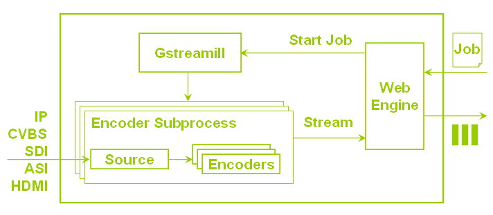

Introduction
************

User send job to gstreamill, gstreamill generate gstreamer pipelines use the job and set their state to playing. The job been sent to gstreamill use http protocol, the job is json type description. The job type maybe live encoder, transcoder. The live encoder can be output live throght udp, http progressive, hls, and can be recorded.

Jobs are submited to gstreamill use json over http. source and encoders are gstreamer pipelines.

gstreamer
=========

element
-------

bin
---

pads&caps
----------

Gstreamill
==========

Jobs
----
