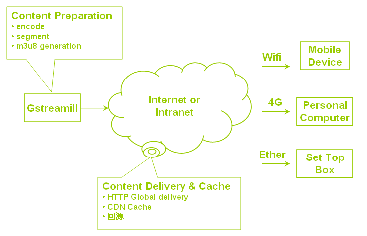

Introduction
************

Gstreamill is an open source, GPL licensed "stream mill" based on gstreamer-1.0.  The "stream mill" can be used as live encoder, transcoder, when used as live encoder, supported output types include udp, http progressive, hls, and recording also supported

To send start job request to gstreamill let it to provoke live encode or transcode, a job is description of live encoder or transcode in json format.

User send job to gstreamill, gstreamill generate gstreamer pipelines use the job and set their state to playing. The job been sent to gstreamill use http protocol, the job is json type description. The following diagram illustrate gstreamill logic:

.. image:: _static/diagram.png

Jobs are submited to gstreamill use json over http. source and encoders are gstreamer pipelines.

Use case:

gstreamer
=========

element
-------

bin
---

pads&caps
----------

Gstreamill
==========

Jobs
----

Logs
----

Default log directory is /var/log/gstreamill. Log file is gstreamill.log. In default log file size is 4M, log rotate size is 100.

Subprocess, also job process, if it is live job, it's default log directory is /var/log/gstreamill/job-name/, job process's log file is gstreamill.log, if it is transcode job, it's log directory is set in job file's "log-path" configure item.
