Using Gstreamill
****************

Prerequisites
=============

Install following package before using gstreamill::

    sudo apt-get install gstreamer1.0-plugins-ugly gstreamer1.0-plugins-bad gstreamer1.0-plugins-good gstreamer1.0-plugins-base

Command line
============

gstreamill
----------

**gstreamill -h**

Print gstreamill help message::

    $ gstreamill -h
    Usage:
      gstreamill [OPTION...]
    
    Help Options:
      -h, --help                        Show help options
      --help-all                        Show all help options
      --help-gst                        Show GStreamer Options
    
    Application Options:
      -j, --job                         -j /full/path/to/job.file: Specify a job file, full path is must.
      -l, --log                         -l /full/path/to/log: Specify log path, full path is must.
      -m, --httpmgmt                    -m http managment address, default is 0.0.0.0:20118.
      -a, --httpstreaming               -a http streaming address, default is 0.0.0.0:20119.
      -s, --stop                        Stop gstreamill.
      -v, --version                     display version information and exit.

**gstreamill -j**

Debug mode, run in foreground, it is useful for job description debug::

    $gstreamill -j examples/test.job
    0:00:00.020376536 10938      0x1fb8e40 WARN              gstreamill main.c:444:main: gstreamill started ...
    0:00:00.024810273 10938      0x1fb8e40 ERROR             gstreamill gstreamill.c:849:gstreamill_job_start: live job arrived:
    /*
     * test job, videotestsrc and audiotestsrc
     */
    {
        "name" : "test",
        "debug" : "gstreamill:3",
        "source" : {
    
        ... ... ...
    
            "window-size" : 10,
            "segment-duration" : 3.00
        }
    }
    0:00:00.025468997 10938      0x1fb8e40 WARN              gstreamill job.c:304:job_initialize: lock output semaphore for initializing
    0:00:00.025502887 10938      0x1fb8e40 WARN              gstreamill job.c:306:job_initialize: locked output semaphore
    0:00:00.025815092 10938      0x1fb8e40 WARN              gstreamill job.c:390:job_initialize: initializing complete, unlock output semaphore
    0:00:00.043864714 10938      0x202b140 WARN                 default gstvideopool.c:171:video_buffer_pool_set_config:<videobufferpool0> no caps in config
    0:00:00.046601404 10938      0x1fb8e40 WARN              gstreamill job.c:807:job_start: Set source pipeline to play state ok
    0:00:00.047702652 10938      0x1fb8e40 WARN              gstreamill job.c:830:job_start: Set encoder encoder.0 to play state ok
    0:00:00.047720656 10938      0x1fb8e40 WARN              gstreamill job.c:833:job_start: Set job test to play state ok
    0:00:00.047732718 10938      0x1fb8e40 WARN              gstreamill main.c:493:main: start job result: success.
    
Use as upstart job on Ubuntu 14.04
---------------------------

**Start gstreamill**

    *sudo service gstreamill start*

**Stop gstreamill**

    *sudo service gstreamill stop*

**Restart gstreamill**

    *sudo service gstreamill restart*

Accessing gstreamill output
===========================

**http progressive streaming**

    *http://gstreamill.server.addr:20119/live/job-name/encoder/encoder_index*

**hls**

    *http://host.name.or.ip:20119/live/job name/playlist.m3u8*

    *http://host.name.or.ip:20119/live/job name/encoder/encoder_index/playlist.m3u8*

**hls time shift**

    *http://gstreamill.server.addr:20119/dvr/job_name/playlist.m3u8?offset=-3600*

**hls catchup**

   *http://gstreamill.server.addr:20119/dvr/job_name/playlist.m3u8?start=1412069895&duration=3600*

**udp**

    *udp://@ip:port*

Use Gstreamill through web managment
====================================

**Default web managment url**

    *http://gstreamill.ip:20118/admin/*

New testsrc Job
---------------

New network source Job
----------------------

New v4l2src Job
---------------

Step 1: Click Jobs menu item

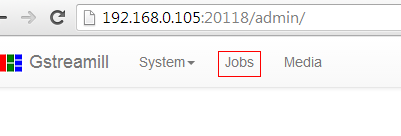

Step 2: Click New Live Job Button

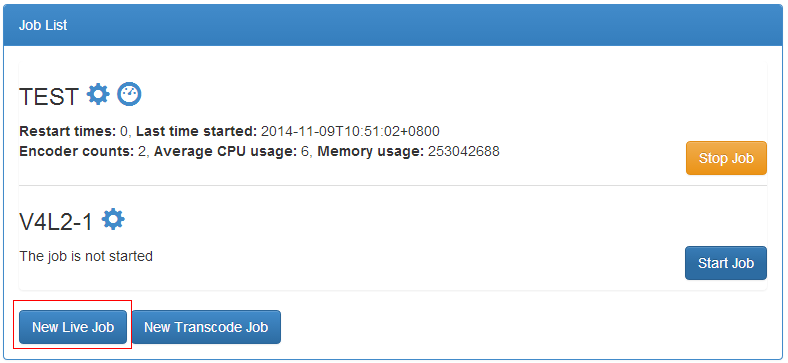

Step 3: Input Job name

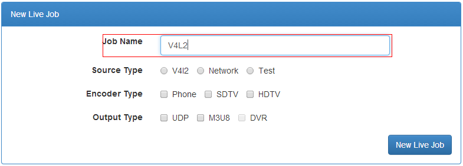

Step 4: Select source type

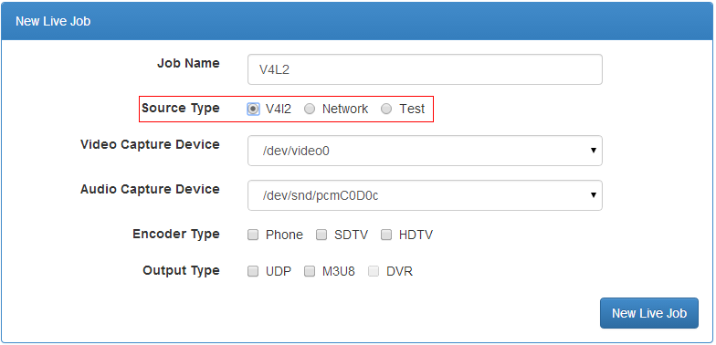

Step 5: Select Video capture device

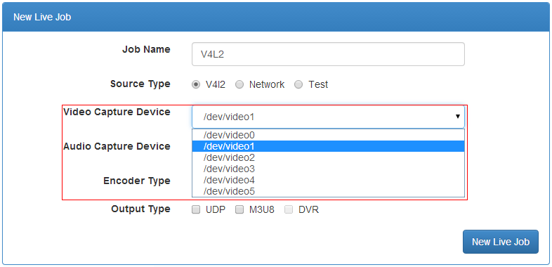

Setp 6: Select Audio Capture device

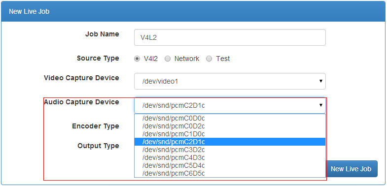

Step 7: Select Encoder type

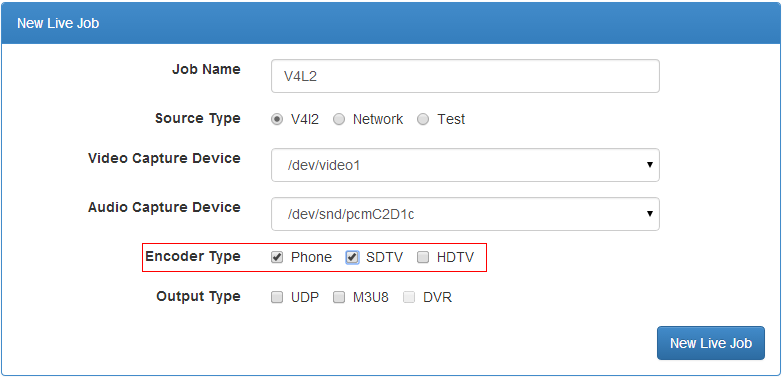

Step 8: Select Output type

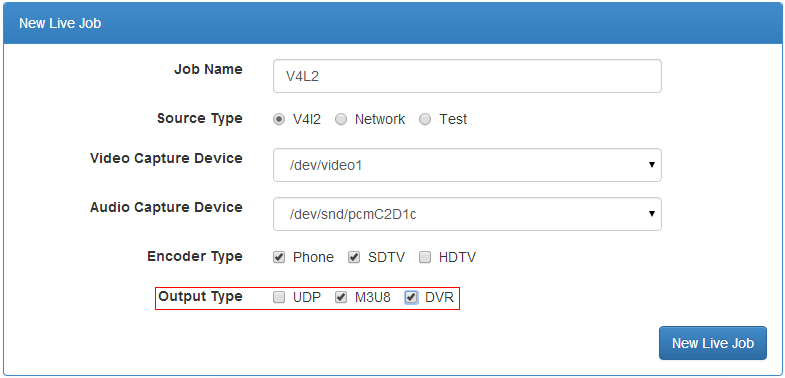

Step 9: Click New Live Job Button

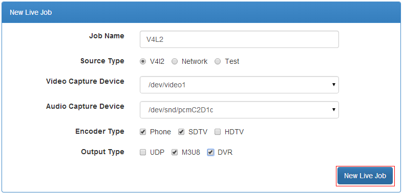

Step 10: New Live Job success, click ok button

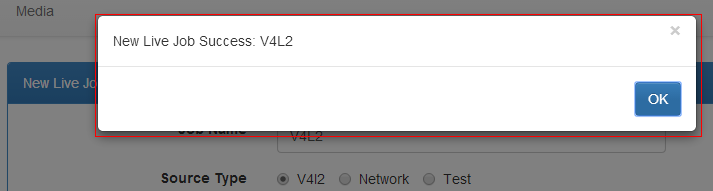

Step 11: Jobs list

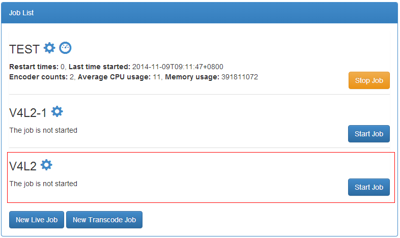
